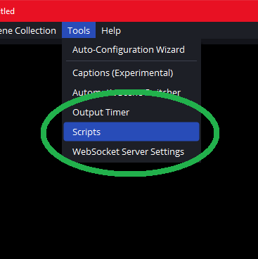
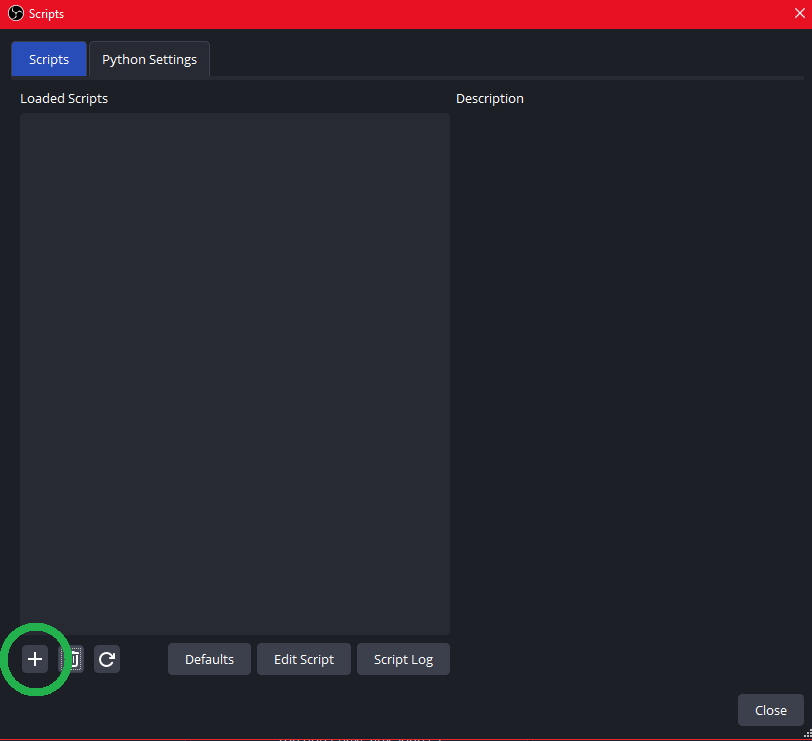
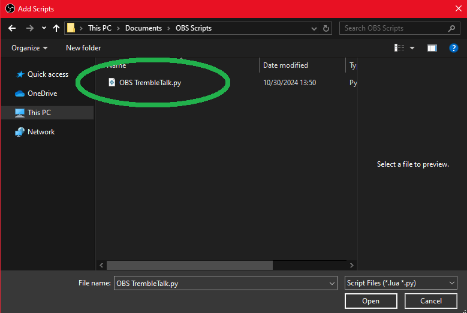
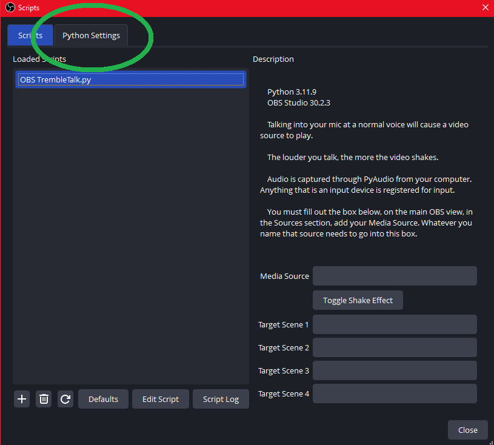
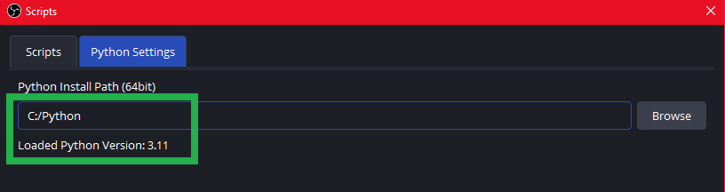
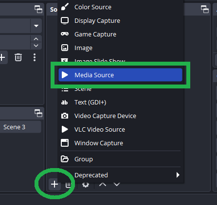
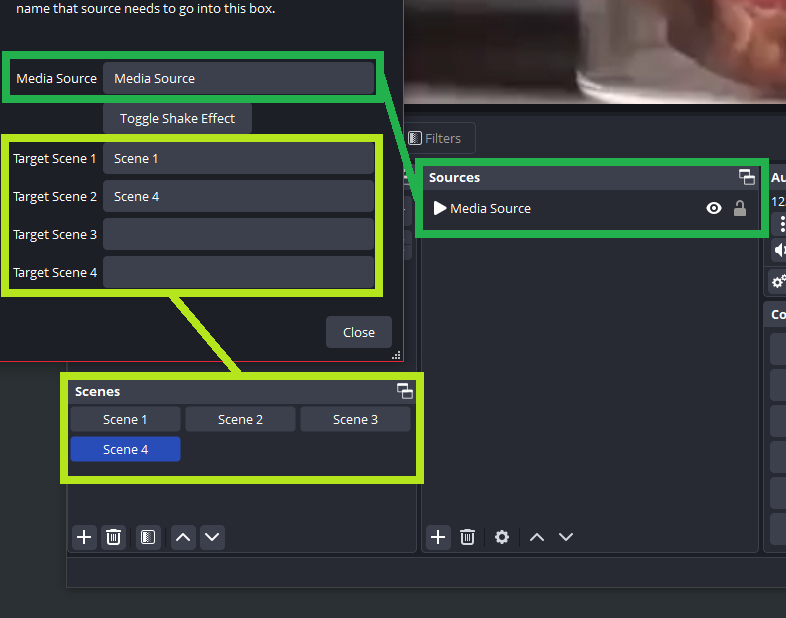
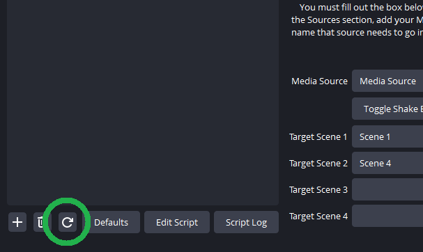

# OBS TrembleTalk!!!!!!!!!!


- Built using Python 3.11.9
- Ran on OBS Studio 30.2.3
<br/><br/><br/>
___
# How it works


- When PyAudio detects dB levels above a certain level, OBS TrembleTalk will start the playback of Media Source.
- When silence is detected for more than .30 seconds, it stops the playback of Media Source and resets the timestamp to 0.
- By default, Toggle Shake Effect is **OFF**. If you toggle Shake Effect to be ON, as the volume of your voice rises, so does the severity of the shake. The video will shake. Its great. 
<br/><br/><br/>
___
# Required Imports
```bash
pip install pyaudio
pip install numpy
```
<br/><br/><br/>
___
# How To Run OBS TrembleTalk in OBS Studio 30.2.3

### Add OBS TrembleTalk to OBS Scripts






<br/><br/><br/>

> :warning: **Warning:** Point OBS to your Python.exe folder location**





<br/><br/><br/>

### **On the main OBS interface, in Source, add a Media Source, and browse for your video**



<br/><br/><br/>

### **Whatever you name your Media Source, as it shows in the Sources area, enter that name into the Media Source field for the OBS TrembleTalk Script.**

You can set up to 4 Scenes in the Script to run only when the active Scene is active. Names must match.


> :warning: **Warning:** THIS IS CASE SENSITIVE




<br/><br/><br/>

**Refresh the Script - Script will run once it can compute audio** [^1]



<br/><br/><br/>

# NOTES
---
[^1]: **Script will run once it can compute audio**
- OBS TrembleTalk uses [PyAudio](https://pypi.org/project/PyAudio/) to detect input audio streams and the dB of that audio. No configuration needed.
